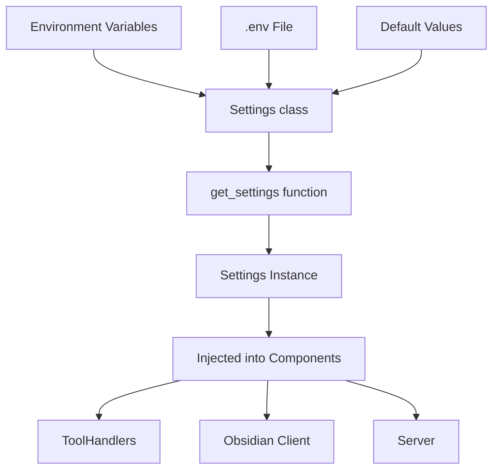

# Configuration System Architecture

## Overview

The mcp-obsidian project uses a centralized, type-safe configuration system built on `pydantic-settings`. This document explains the core concepts and benefits of this approach.

## Core Concepts

### 1. Single Source of Truth

All configuration logic lives in one place: `src/mcp_obsidian/config.py`

**What's in config.py:**
```python
# config.py - This module defines the configuration system
from pydantic_settings import BaseSettings

class Settings(BaseSettings):
    """Configuration model with all settings defined as fields."""
    obsidian_api_key: str
    obsidian_host: str = "127.0.0.1"
    obsidian_port: int = 27124
    # ... more configuration fields

def get_settings() -> Settings:
    """Factory function that creates a Settings instance."""
    return Settings()  # Reads from env vars and .env file
```

**How to use it in other modules:**
```python
# server.py - Using the configuration
from mcp_obsidian.config import Settings, get_settings

# Get a configured instance
config = get_settings()  # Returns a Settings object with all values loaded

# Now you can access configuration values
print(config.obsidian_host)  # "127.0.0.1"
print(config.obsidian_port)  # 27124

# Pass to components that need it
handler = ToolHandler(config)  # config is a Settings instance
```

**Benefits:**
- No more searching through code to find where settings are defined
- Consistent defaults across the entire application
- Easy to see all available configuration options at a glance

### 2. Multiple Configuration Sources

The system supports configuration from multiple sources, with clear precedence:

```
1. Environment variables (highest priority)
2. .env file (for local development)
3. Default values in code (fallback)
```

Example flow:
```python
# In .env file
OBSIDIAN_PORT=8080

# In environment
export OBSIDIAN_PORT=9090

# Result: port will be 9090 (environment wins)
```

### 3. Type Safety and Validation

Every configuration value is typed and validated:

```python
class Settings(BaseSettings):
    obsidian_port: int = Field(default=27124, ge=1, le=65535)
    obsidian_protocol: str = Field(default="https")
    
    @field_validator("obsidian_protocol")
    def validate_protocol(cls, v: str) -> str:
        if v.lower() not in ("http", "https"):
            return "https"  # Safe default
        return v.lower()
```

**Benefits:**
- Catch configuration errors at startup, not runtime
- IDE autocomplete and type hints
- Automatic conversion (e.g., string "8080" → integer 8080)
- Custom validation rules (e.g., port must be 1-65535)

### 4. Configuration Injection

Configuration is explicitly passed to components that need it:

```python
# Configuration is injected, not globally accessed
class ToolHandler:
    def __init__(self, config: Settings):
        self.config = config
```

**Benefits:**
- Clear dependencies - you know what uses configuration
- Easy to test with mock configurations
- No hidden global state

### 5. Testability

Different configurations for different test scenarios:

```python
# Unit test with specific config
def test_with_custom_port():
    # Create Settings instance directly with test values
    test_config = Settings(
        obsidian_api_key="test-key",
        obsidian_port=9999
    )
    handler = ToolHandler(config=test_config)
    assert handler.config.obsidian_port == 9999

# Integration test with environment
def test_with_env():
    with patch.dict(os.environ, {"OBSIDIAN_PORT": "7777"}):
        config = get_settings()  # This reads from the patched environment
        assert config.obsidian_port == 7777
```

## How Settings and get_settings() Work Together

The `config.py` module provides two key exports:

1. **Settings class** - The schema/model that defines what configuration fields exist
2. **get_settings() function** - Factory function that creates Settings instances

Here's the complete `config.py` structure:

```python
# config.py
from pydantic_settings import BaseSettings, SettingsConfigDict

class Settings(BaseSettings):
    """The configuration schema - defines all fields and their types."""
    
    # Required fields (no default value)
    obsidian_api_key: str
    
    # Optional fields (with defaults)
    obsidian_host: str = "127.0.0.1"
    obsidian_port: int = 27124
    
    # Pydantic configuration
    model_config = SettingsConfigDict(
        env_file=".env",  # Load from .env file if present
        case_sensitive=False
    )

def get_settings() -> Settings:
    """Create a new Settings instance.
    
    This function:
    1. Reads environment variables
    2. Reads .env file (if present)
    3. Applies defaults
    4. Validates all values
    5. Returns a Settings instance
    """
    return Settings()

# Optional: Cached version for production
_settings_cache = None

def get_cached_settings() -> Settings:
    """Return the same Settings instance on every call (singleton)."""
    global _settings_cache
    if _settings_cache is None:
        _settings_cache = Settings()
    return _settings_cache
```

Usage patterns in different parts of the application:

```python
# server.py - Application startup
from mcp_obsidian.config import Settings, get_settings

# Create configuration instance once at startup
config: Settings = get_settings()

# Pass to all components that need it
tool_handler = ToolHandler(config)
```

```python
# tools.py - Tool implementation
from typing import TYPE_CHECKING

if TYPE_CHECKING:
    from mcp_obsidian.config import Settings

class ToolHandler:
    def __init__(self, config: 'Settings'):
        # We receive a Settings instance, not create one
        self.config = config
    
    def use_config(self):
        # Access configuration values through the instance
        api_url = f"{self.config.obsidian_host}:{self.config.obsidian_port}"
```

## Configuration Flow



## Practical Benefits

### For Development

- **Auto-completion**: Your IDE knows all available settings and their types
- **Early error detection**: Invalid configuration fails at startup, not during execution
- **Easy debugging**: Set breakpoints in one config file to debug all settings

### For Testing

- **Isolation**: Each test can have its own configuration
- **No side effects**: Tests don't affect each other's configuration
- **Mock-friendly**: Easy to inject test configurations

### For Deployment

- **Environment-based**: Different settings for dev/staging/production
- **Secure**: Sensitive values (API keys) stay in environment variables
- **Validated**: Configuration errors caught before the application starts serving requests

## Example: Adding a New Configuration Option

Let's say you want to add a request retry count:

1. **Define in `config.py`:**
```python
class Settings(BaseSettings):
    # ... existing fields ...
    
    obsidian_max_retries: int = Field(
        default=3,
        ge=0,
        le=10,
        description="Maximum number of API request retries",
        alias="OBSIDIAN_MAX_RETRIES"
    )
```

2. **Use in your code:**
```python
class YourToolHandler(ToolHandler):
    def make_request(self):
        for attempt in range(self.config.obsidian_max_retries):
            try:
                return self.api.call()
            except Exception:
                if attempt == self.config.obsidian_max_retries - 1:
                    raise
```

3. **Override in tests:**
```python
def test_no_retries():
    config = Settings(
        obsidian_api_key="test",
        obsidian_max_retries=0  # No retries for this test
    )
    handler = YourToolHandler(config=config)
    # Test behavior with no retries
```

4. **Configure in production:**
```bash
export OBSIDIAN_MAX_RETRIES=5
```

## Comparison with Previous Approach

### Before (Scattered)
```python
# In tools.py
api_key = os.getenv("OBSIDIAN_API_KEY", "")

# In server.py
host = os.getenv("OBSIDIAN_HOST", "127.0.0.1")

# In obsidian.py
port = int(os.getenv("OBSIDIAN_PORT", "27124"))  # Hope it's a valid int!
```

Problems:
- Configuration scattered across files
- No type checking
- No validation
- Hard to test
- Easy to miss settings

### After (Centralized)
```python
# config.py - All configuration in one place
class Settings(BaseSettings):
    obsidian_api_key: str
    obsidian_host: str = "127.0.0.1"
    obsidian_port: int = 27124  # Automatically converted and validated

def get_settings() -> Settings:
    return Settings()

# server.py - Using the configuration
from mcp_obsidian.config import get_settings
config = get_settings()
```

Benefits:
- One place to look
- Type-safe
- Validated
- Testable
- Self-documenting

## When to Use Configuration

Use the configuration system for:
- API endpoints and credentials
- Timeouts and retry counts
- Feature flags
- Resource limits
- Any value that might change between environments

Don't use it for:
- Constants that never change
- Business logic rules
- Computed values (use properties instead)

## Further Reading

- [Pydantic Settings Documentation](https://docs.pydantic.dev/latest/usage/pydantic_settings/)
- [Configuration Migration Guide](CONFIG_MIGRATION.md) - How to migrate existing code
- [12-Factor App Configuration](https://12factor.net/config) - Industry best practices